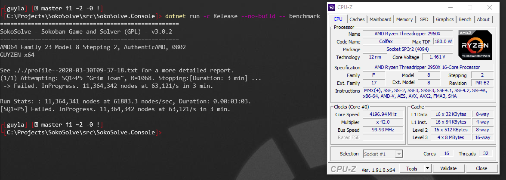

# SokoSolve
Sokoban puzzle game and solver


The original project was started and hosted at SourceForge ([code](https://sourceforge.net/projects/sokosolve/), [web](https://web.archive.org/web/20180315141727/http://sokosolve.sourceforge.net/)) 

After many years, it was moved to github, upgraded and stripped down (dropped the WinForms GUI).

## Getting Started

```cmd
C:\Projects\> git clone https://github.com/guylangston/SokoSolve.git
C:\Projects\SokoSolve\> benchmark.ps1
```

## Game

I have not ported over the GUI or Console game client from the old source-forge repo. There are NO current plans to re-implement a user interface in WinForms. I have started a Web UI, but that is only for the solve.


## Solver

```pwsh
C:\Projects\SokoSolve\> benchmark.ps1
```

Almost all new work has been modernizing and updating the Solver. The solver is now at least 10x faster (with Time I will document the improvement and add some graphs).  As the solver is long-running and complex it is not a good fit for BenchmarkDotNet. Instead use the ``profile`` command:




To standardize measurement, I use the same puzzle, and a 3-min timeout.
```
 Ident: SQ1~P5
Rating: 1068
~~~~~~~~~~~#####
~~~~~~~~~~##...#
~~~~~~~~~~#....#
~~~~####~~#.X.##
~~~~#..####X.X#~
~~~~#.....X.X.#~
~~~##.##.X.X.X#~
~~~#..O#..X.X.#~
~~~#..O#......#~
#####.#########~
#OOOO.P..#~~~~~~
#OOOO....#~~~~~~
##..######~~~~~~
~####~~~~~~~~~~~
```

### Solver Progress / Benchmark Progress

> **Status**: After a deep-drive into perf, I need to stabalise the solver (yes, it got faster, but it added threading bugs)

Best Attempt (SQ1~P5,Rating: 1068):
```
 removed -- bugs showed false progress...

```

## Library

The original code used a SQL database for most internal testing. This has been removed, as I don't want any external dependencies.
